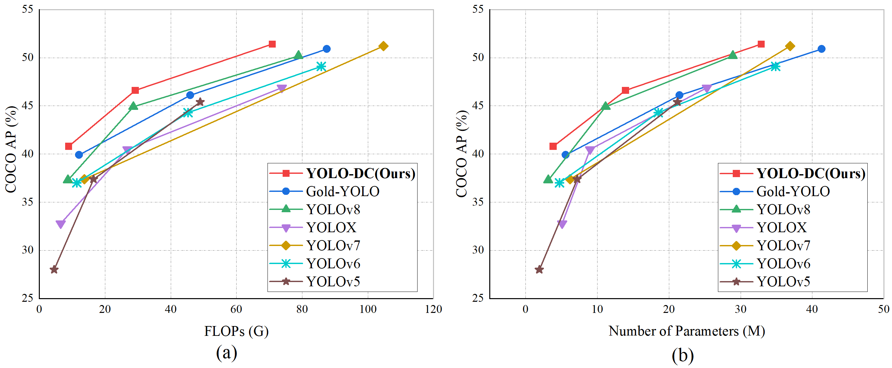

# YOLO-DC: Enhancing object detection with deformable convolutions and contextual mechanism


## Introduction
YOLO-DC outperforms numerous state-of-the-art (SOTA) algorithms, including YOLOv8, while maintaining a comparable level of computation and parameter count.
For more details, please refer to our [report on Github](https://github.com/Object-Detection-01/YOLO-DC/blob/main/YOLO-DC__YOLO%20Object%20Detectors%20Based%20on%20Deformable%20Convolutions%20.pdf). The related paper has been accepted for publication in *Signal Processing: Image Communication*.


In the figure above, (a) and (b) depict comparisons of computational and parameter counts among the models on the COCO 2017 dataset, respectively.

## Benchmark

|Model |size |AP<sup>val<br>0.5:0.95 |AP<sup>val<br>0.5 | Params<br>(M) |FLOPs<br>(G)|
| ------        |:---: | :---:    | :---:       |:---:  | :---: |
|YOLO-DC-N   |640  |40.8 |56.9     |3.9 | 8.9 |
|YOLO-DC-S   |640  |46.6 |63.5     |13.9 | 29.2 |
|YOLO-DC-M   |640  |**50.4** |**67.3**     |32.9 | 70.9 |

Table Notes

- Results of the AP and speed are evaluated on [COCO val2017](https://cocodataset.org/#download) dataset with the input
  resolution of 640×640.
- All experiments are based on NVIDIA 3090 GPU.

## Environment

- python requirements

  ```shell
  pip install -r requirements.txt
  ```
  If you are prompted that a package is missing, follow the corresponding prompts to follow that package.
- data:

  prepare [COCO](http://cocodataset.org)
  dataset, YOLO format coco labels and
  specify dataset paths in data.yaml (data.yaml is located at ". /ultralytics/datasets/coco.yaml").

## Train

  ### 1. command-line mode
  - See train.py for more information on how to use it.

  ```shell
  python ./train.py 
                --yaml ./ultralytics/models/v8/YOLO-DC.yaml
                --data ./ultralytics/datasets/coco.yaml
                --weight path
                --epoch 500 
                --device 0,1,2,3,4
                --batch 128
  ```
  ### 2. python
  Writing direct Python code such as main.py is an example.
   ```shell
from ultralytics import YOLO
def main():
    # 加载模型
    model = YOLO("./ultralytics/models/v8/yolov8n-DC.yaml")  # 从头开始构建新模型
    # model = YOLO("./runs/detect/train_500/weights/best.pt")  # 加载预训练模型（建议用于训练）

    # 使用模型
    model.train(data="./ultralytics/datasets/coco.yaml",
                epochs=500, device='cuda:0',
                batch=48,
                save_period=50,
                verbose=True,
                project="COCO",
                name="train_DC_n_500",
                profile=True,)  # 训练模型
    metrics = model.val(name="val_DC_n_500")  # 在验证集上评估模型性能
if __name__ == '__main__':
    main()

  ```
 ### 3. cite
 If you feel our work is helpful to you, please cite the following paper:
  ```
@INPROCEEDINGS{YOLO-DC,
  author={Zhang, Dengyong and Xu, Chuanzhen and Chen, Jiaxin and Deng, Bin and Liao, Xin},
  booktitle={2024 Asia Pacific Signal and Information Processing Association Annual Summit and Conference (APSIPA ASC)}, 
  title={YOLO-DC: Enhancing object detection with deformable convolutions and contextual mechanism}, 
  year={2024},
  volume={},
  number={},
  pages={1-6},
  keywords={Convolutional codes;Deformable models;Convolution;Source coding;Data preprocessing;Object detection;Information processing;Feature extraction;Data models;Detection algorithms},
  doi={10.1109/APSIPAASC63619.2025.10848905}}
 ```

## Acknowledgement

The implementation is based on [YOLOv8](https://github.com/ultralytics/ultralytics). Thanks for their open source code.
